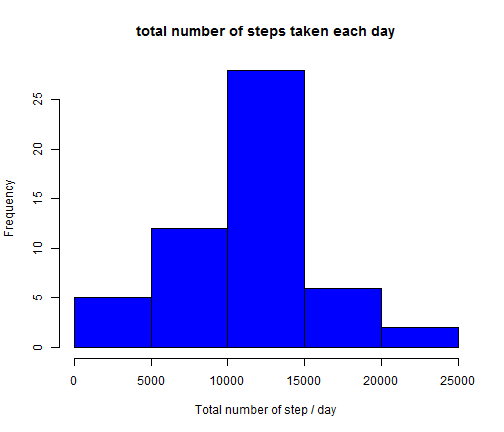
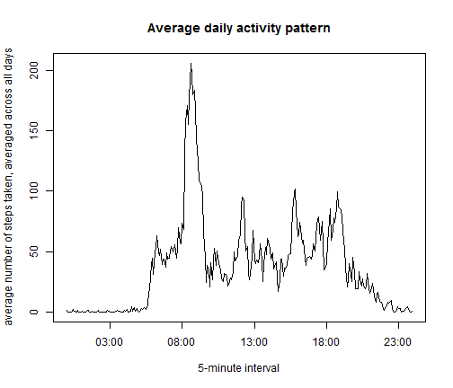
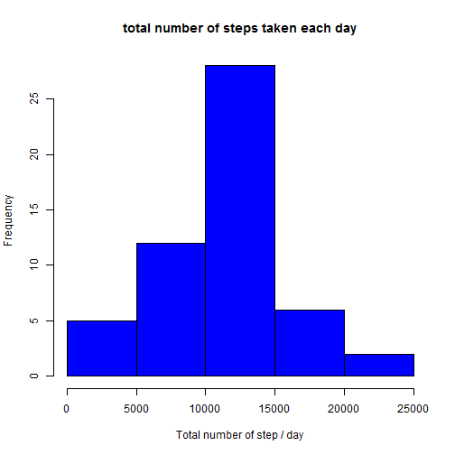
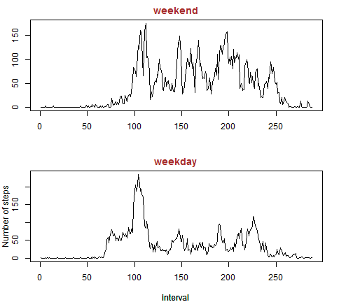

# Reproducible Research: Peer Assessment 1
=================================================

```r
# static var for the main directory that contain the files
dataDir <- "data\\activity.csv"

substrRight <- function(x, n) {
    substr(x, nchar(x) - n + 1, nchar(x))
}

# Clean the data
cleanDates <- function() {
    data <- read.csv(dataDir, sep = ",", na.strings = "NA")
    # fix interval format
    data$interval = formatC(data$interval, width = 4, format = "d", flag = "0")
    # formatDate
    data$date <- paste(data$date, paste(substr(data$interval, 0, 2), substrRight(data$interval, 
        2), sep = ":"), sep = " ")
    # convert to date
    data$date <- strptime(data$date, format = "%Y-%m-%d %H:%M")
    data[, c("date", "steps")]
}

# create a graphics and return the mean / median by day
numberStepsPerDay <- function(dataset) {
    dataset$date = as.Date(dataset$date)
    stepsPerDay <- aggregate(dataset$steps, list(dataset$date), sum)
    names(stepsPerDay) <- c("date", "steps")
    hist(stepsPerDay[, 2], xlab = "Total number of step / day", main = "total number of steps taken each day", 
        col = "blue")
    # Mean total number of steps taken per day
    meanDay <- mean(stepsPerDay$steps, na.rm = T)
    # Median total number of steps taken per day
    medianDay <- median(stepsPerDay$steps, na.rm = T)
    return(list(meanDay = meanDay, medianDay = medianDay))
}

# Get the average Daily activity by 5 minutes interval
averageDailyActivity <- function(dataset) {
    dataset$date <- strptime(dataset$date, format = "%Y-%m-%d %H:%M")
    averageSteps <- aggregate(dataset$steps, list(strftime(dataset$date, format = "%H:%M")), 
        mean)
    names(averageSteps) = c("interval", "steps")
    return(averageSteps)
}

# Create a time series plot of the 5-minute interval (x-axis) and the
# average number of steps taken, averaged across all days
plotDates <- function(averageStepsData) {
    with(averageStepsData, {
        intervals <- strptime(interval, format = "%H:%M")
        plot(intervals, steps, type = "l", main = "Average daily activity pattern", 
            ylab = "average number of steps taken, averaged across all days", 
            xlab = "5-minute interval")
    })
}

# fill NA with the mean for that day
fillEmptyValues <- function(data) {
    tmpdata = na.omit(data)
    # Mean total number of steps taken per day
    meanDay <- aggregate(tmpdata$steps, list(as.Date(tmpdata$date)), mean)
    names(meanDay) = c("dateMerge", "stepsMean")
    dataNew <- cbind(data, as.Date(data$date))
    names(dataNew) = c(names(data), "dateMerge")
    dataNew <- merge(x = dataNew, y = meanDay, by.x = "dateMerge", by.y = "dateMerge")
    for (i in 1:nrow(dataNew)) {
        if (is.na(dataNew[i, ]$steps)) {
            dataNew[i, ]$steps = dataNew[i, ]$stepsMean
        }
    }
    return(dataNew[, c("date", "steps")])
}

# Create the level based on the week day of the date
createLevel <- function(dataNew) {
    dataNew <- cbind(dataNew, weekdays(as.Date(dataNew$date)))
    names(dataNew) <- c(names(dataNew)[1:2], "weekday")
    dataNew$weekday = as.character(dataNew$weekday)
    dataNew[which(dataNew$weekday == "Saturday" | dataNew$weekday == "Sunday"), 
        ]$weekday = "weekend"
    dataNew[which(dataNew$weekday != "weekend"), ]$weekday = "weekday"
    dataNew$weekday = as.factor(dataNew$weekday)
    return(dataNew)
}

# function to create two side graphics baed on the level (Weekday / Weekend)
createLevelGraph <- function(dataNew) {
    dataNew$date <- strptime(dataNew$date, format = "%Y-%m-%d %H:%M")
    avgNewData <- averageDailyActivity(subset(dataNew, weekday == "weekday"))
    avgNewDataWeekend <- averageDailyActivity(subset(dataNew, weekday == "weekend"))
    par(mfrow = c(2, 1))
    par(mar = c(4, 3, 2, 3))
    with(avgNewDataWeekend, {
        plot(steps, type = "l", main = "", ylab = "", xlab = "")
    })
    title("weekend", col.main = "brown")
    with(avgNewData, {
        plot(steps, type = "l", main = "", ylab = "", xlab = "Interval")
    })
    title("weekday", col.main = "brown", xlab = "interval")
    mtext("Number of steps", 2, 2)
}
```


## Loading and preprocessing the data

```r
data <- cleanDates()
dataNaOmit <- na.omit(cleanDates())
```


## What is mean total number of steps taken per day?


```r
res <- numberStepsPerDay(dataNaOmit)
```

 


- the mean total number of steps is 1.0766 &times; 10<sup>4</sup>
- the median total number of steps is 10765


## What is the average daily activity pattern?


```r
averageSteps <- averageDailyActivity(dataNaOmit)
# 5-minute interval with max number of step
intervalWithMaxNumberSteps <- averageSteps[which(max(averageSteps$steps) == 
    averageSteps$steps), ]$interval
plotDates(averageSteps)
```

 

- the 5-minute interval, on average across all the days in the dataset, that contains the maximum number of steps is 08:35


## Imputing missing values
- The total number of missing values in the dataset 2304 


```r
dataNew <- fillEmptyValues(data)
meanAndMedian <- numberStepsPerDay(dataNew)
```

 

- the mean total number of steps is 1.0766 &times; 10<sup>4</sup>
- the median total number of steps is 10765

The mean and median don't differ from the estimates from the first part of the assignment.


## Are there differences in activity patterns between weekdays and weekends?

```r
# Add levels WeekDays
dataNew <- createLevel(dataNew)
# create graphic
createLevelGraph(dataNew)
```

 

